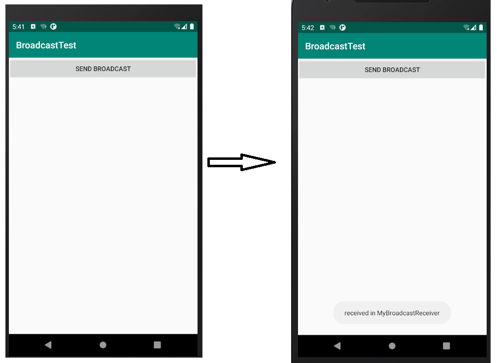

## BroadcastTest

## 实验要求

自定义广播的使用

------

## 实验目的

了解广播，学会自定义广播的使用


#### 发送自定义广播




#### 实验总结


通过这次实验，我了解了广播，学会了发送自定义广播。广播主要分为两种类型：标准广播和有序广播。广播是一种可以跨进程的通信方式。

**本次实验中遇遇到了一个坑，自定义广播无法接受。**

在Android8.0上发送广播，需要指明是哪个广播接收器处理此广播。

```
  Intent intent = new Intent("com.example.broadcasttest.MY_BROADCAST");
  //这里有坑
  intent.setComponent(new ComponentName("com.example.broadcasttest","com.example.broadcasttest.MyBroadcastReceiver"));

sendBroadcast(intent);
```


