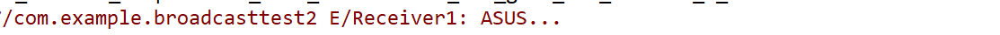

## BroadcastTest

## 实验要求

自定义广播的使用

------

## 实验目的

了解广播，学会自定义广播的使用


#### 发送自定义广播


#### 发送有序广播

接收者接收有序广播有优先级之分，有序广播可以被接收者拦截、修改。

定义两个广播接收器

```java
public class Receiver1 extends BroadcastReceiver {

    @Override
    public void onReceive(Context context, Intent intent) {
        String name = intent.getStringExtra("name");
        Log.e("Receiver1", name);
        //拦截广播
        abortBroadcast();
    }
}

```

```java
public class Receiver2 extends BroadcastReceiver {

    @Override
    public void onReceive(Context context, Intent intent) {
        String name = intent.getStringExtra("name");
        Log.e("Receiver2", name);
    }
}

```

在activity中注册广播接受者，设置优先级，发送有序广播

```java
public class MainActivity extends AppCompatActivity {

        Receiver1 receiver1;
        Receiver2 receiver2;

        @Override
        protected void onCreate(Bundle savedInstanceState) {
            super.onCreate(savedInstanceState);
            setContentView(R.layout.activity_main);
            //动态注册接收者1，接收优先级1

            IntentFilter intentFilter1 = new IntentFilter("com.example.leidong.action.OrderedBroadcast");
            receiver1 = new Receiver1();
            intentFilter1.setPriority(1);
            registerReceiver(receiver1, intentFilter1);

            //动态注册接收者2，接收优先级0
            IntentFilter intentFilter2 = new IntentFilter("com.example.leidong.action.OrderedBroadcast");
            receiver2 = new Receiver2();
            intentFilter1.setPriority(0);
            registerReceiver(receiver2, intentFilter2);
            //发送有序广播
            Intent intent = new Intent("com.example.leidong.action.OrderedBroadcast");
            intent.putExtra("name", "ASUS...");
            sendOrderedBroadcast(intent, null);
        }

        @Override
        protected void onDestroy() {
            //广播注销
            unregisterReceiver(receiver1);
            unregisterReceiver(receiver2);
            super.onDestroy();
        }


}
```

打印结果




> 1.发送有序广播： `sendOrderedBroadcast(intent, null);`，并且广播接收者要设置优先级。
> 2.拦截广播： `abortBroadcast();`

#### 实验总结


通过这次实验，我了解了广播，学会了发送自定义广播。广播主要分为两种类型：标准广播和有序广播。广播是一种可以跨进程的通信方式。

**本次实验中遇遇到了一个坑，自定义广播无法接受。**

在Android8.0上发送广播，需要指明是哪个广播接收器处理此广播。

```
Intent intent = new Intent("com.example.broadcasttest.MY_BROADCAST");
  //这里有坑
intent.setComponent(new ComponentName("com.example.broadcasttest","com.example.broadcasttest.MyBroadcastReceiver"));
sendBroadcast(intent);
```

广播的注册方式分为两种：

1. 静态注册，也就是说在AndroidManifest文件中对BroadcastReceiver进行注册，通常还会加上action用来过滤。
2. 动态注册，调用Context中的registerReceiver对广播进行动态注册，使用unRegisterReceiver方法对广播进行取消注册的操作。

android 8.0已经限制了静态注册。本次实验，发送自定义标准广播使用静态注册，测试发送有序广播使用动态注册。