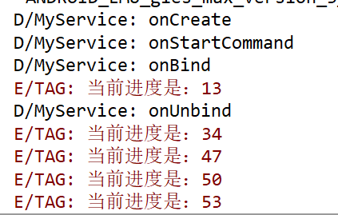

### 实验要求

启动和停止服务，服务代码运行子线程（注意：一定要熟练到，哪部分代码在哪部个时间片运行，哪个变量是独立的，哪个变量是共享的，多个线程之间如何通讯）

### 实验过程

#### 启动与关闭服务


#### Service的生命周期


一个Service只用一个实例

### 使用IntentService

Service中的代码都是默认运行在主线程之中的，如果直接在服务里去处理一些耗时的逻辑，就很容易出现ANR（Application Not Responding）的情况。这个时候就要用到Android的多线程技术了，应该在服务每个具体的方法里开启一个子线程。


IntentService 集开启线程和自动停止于一身。


#### 在MyService.onStartCommand中开启一个线程，模拟耗时任务

子线程里执行从1数到100的任务

```java

    @Override
    public int onStartCommand(Intent intent, int flags, int startId) {
        Log.d(TAG,"onStartCommand");
        /*new Thread(new Runnable() {
            @Override
            public void run() {
                //Log.d(TAG,"处理具体的逻辑");

            }
        }).start();*/
        new Thread(){
            @Override
            public void run() {
                super.run();
                try {
                    for (i = 1; i <= 100; i++) {
                        sleep(1000);
                    }
                }catch (Exception e){
                    e.printStackTrace();
                }
            }
        }.start();
        return super.onStartCommand(intent, flags, startId);

    }
```

MainActivity.java里获得子线程的进度

```java
  /**
     * Service成功绑定时执行该方法
     * @param name
     * @param iBinder
     */
    @Override
    public void onServiceConnected(ComponentName name, IBinder iBinder) {

        MyService.MyBinder mb = (MyService.MyBinder) iBinder;
        int step = mb.getProcess();
        Log.e("TAG","当前进度是：" + step);
    }
```

